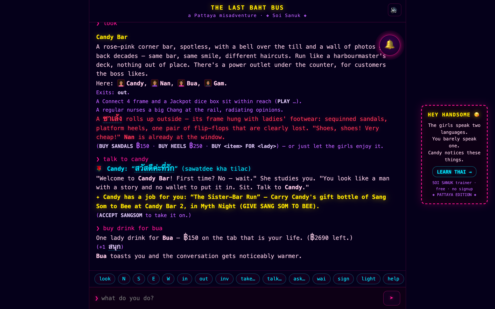
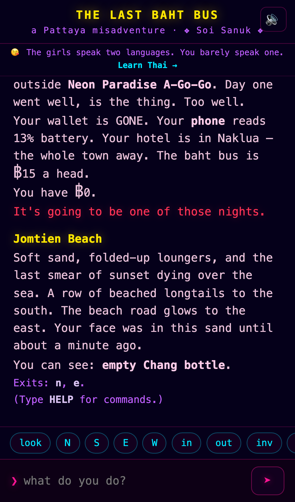
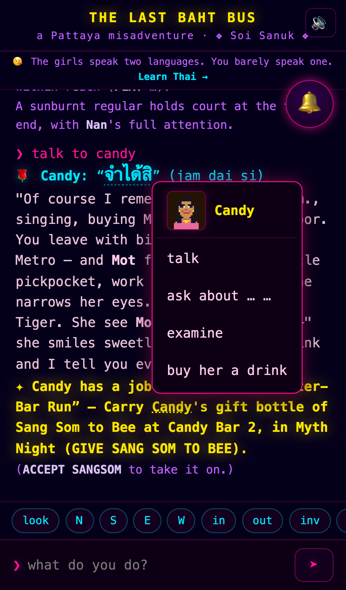
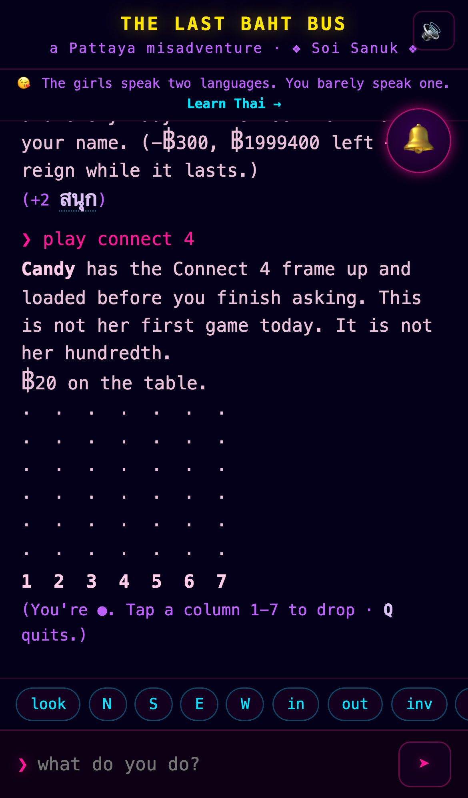
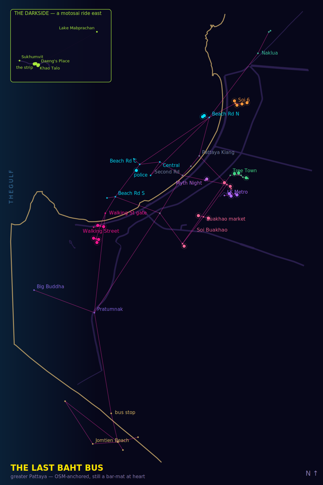
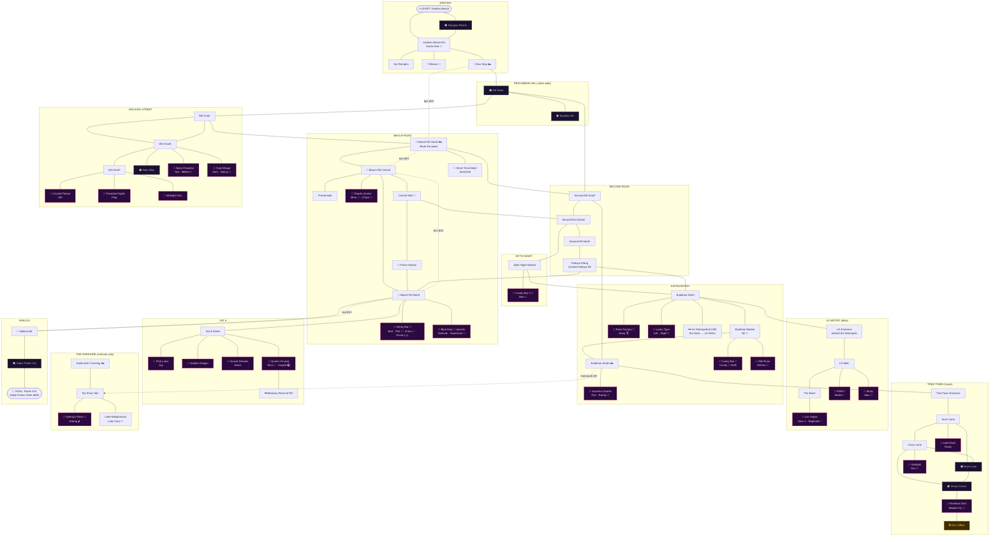

# The Last Baht Bus

A Zork-style adventure-turned-sandbox set in the neon streets of Pattaya —
part of the [Soi Sanuk](https://soisanuk.github.io/) universe.

You wake face-down on Jomtien beach at sunset. Wallet: gone. Phone: 13%.
Your hotel is in Naklua, a long way north. The baht bus is ฿15 a head.
You have ฿0.

That's day two of your week-long holiday (day one is how you ended up on the
beach), and it's only **Act One**. Solve it — the wallet, the gossip chain,
the safe, the ride home — and the room safe opens: ฿3,000 of emergency cash
and the rest of the vacation to spend it in. The goal is the oldest one on
the soi: **get happy**. A สนุก meter climbs (and dips) with everything you do
— bar games, barfines, bell rings, wai-ed mamasans, soi dogs, scams,
ejections — from เหนื่อย (running on empty) all the way to สบายสบาย.

Nights run 18:00–04:00 and your body keeps its own books: hunger, thirst,
drink, and injuries all pull at the meter, and red-lining any of them ends
the night early. When the week is up, choose: **fly home and come back**
(a fresh vacation, no lead-in adventure, chasing a new happiness high), or
**make the move** — expat mode, the true endless sandbox. (They say the
smart ones end up owning a bar. One day, so will you.)

## Play

Open `web/index.html` in a browser — no build step, no dependencies, works from `file://`.
Mobile gets tappable verb chips; desktop gets ↑/↓ command history.

<p align="center">
  
</p>

On a phone the whole game plays by tapping: any glowing word opens a flyout
wheel of actions (long-press for the full list, portraits included), exits and
ALL-CAPS hints fire on tap, and a bell button floats over every bar.

<p align="center">
  
  
  
</p>

The world is anchored to the real city — every room carries OpenStreetMap
coordinates (`ROOM_GEO`), and `tools/gen-map.mjs` renders them over the actual
street geometry (and audits every exit's compass direction against the real
bearing):

<p align="center">
  
</p>

## The game

- **70 rooms** across Jomtien, Pratumnak Hill, Beach Road, Second Road,
  Pattaya Klang, Central mall, Myth Night, Walking Street, Soi Buakhao, the
  Tree Town maze, the LK Metro alley, Soi 6, the Darkside (Lake Mabprachan &
  Soi Khao Talo), and Naklua. All 20 canon bars are enterable — plus Candy
  Bar 2 (the empire expands), the Stinky Bar (Bert's pool-league home felt),
  Tequila Queen (the oldest go-go in Pattaya, with the girls to match), the
  Queen Vic (the air-conditioned expat refuge halfway down Soi 6), and
  Daeng's Place out on the Darkside.
- **Adventures**: a proper quest log — givers offer jobs in conversation,
  `ACCEPT` / `ABANDON` / `QUESTS` manage them, rewards pay out in baht and
  สนุก, and some quests unlock others.
- **Your phone is a social organ**: `CONTACT` a girl in her bar to swap LINE
  numbers, `MESSAGE` her sweet nothings, `CHECK MESSAGES` when it buzzes —
  girls text first (invitations worth honouring, money stories worth judging),
  and the banking app (`SEND <amt> TO <name>`) moves baht both ways.
- **Money**: scrounge your first ฿15, then work the soi economy — bottle
  deposits, favours for the piwin, lady-drink diplomacy (฿150, as ever).
- **Phone battery is your lamp**: 13% and falling. Dark sois have soi dogs.
  ("You are likely to be bitten by a soi dog.")
- **Transport**: baht buses (฿15, the driver quotes the fare in spoken Thai —
  pay attention and pay exactly), motosai (faster, pricier, and the piwin
  network remembers a favour), or your own feet in the dark. Once you know a
  place, `TRAVEL <bar>` (or just `GO <bar>`, or tapping its name) walks you
  there on autopilot — free, but at honest walking pace: the minimum turns
  the trip would take, every one of them on the clock. Bare `TRAVEL` lists
  everywhere you know; your hotel is on the list from turn one, because
  knowing where you sleep is the premise.
- **Thai as puzzle**: read เปิด/ปิด signs, navigate the Tree Town maze by its
  painted Thai arrows, and crack a safe whose keypad speaks only ๐–๙.
  A `wai` and a `sawatdee` open more doors than money.
- **Two solutions**: burgle the safe behind the go-go, or earn the Mamasan's
  respect and be handed your wallet like a gentleman. The Act One score
  reflects style — and converts into a happiness head start.
- **The sandbox**: no key card, no Room 412 (it's in the wallet) — but once
  Act One is done, Pattaya stays open. Chase สบายสบาย (happiness 100): the
  meter moves with wins and losses across every system in the game, and
  hitting the top is a celebration, not a credits roll.
- **Barfines** (PG-13, as ever): earn her favor first — this is Pattaya, not
  a vending machine. Beer bars ฿400, go-gos ฿1,000, and the rest of that
  night is nobody's business but the soi's (+10 สนุก). Soi 6 (฿700) has
  "upstairs", and the night carries on. Mamasans are not barfineable;
  cashiers only after the bell has rewritten the rules. **The clock sets the
  rate**: before 21:00 you pay for her whole lost shift (×1.5); after
  midnight most beer bars quietly close the book — except for the popular
  girls, who stay on it at any hour. And if you're a true regular, late
  enough and liked enough, a girl may pay her **own** barfine. It's the
  highest compliment the soi pays; don't say no.
- **The daily damage**: on vacation, the lobby ATM surrenders ฿3,000 on your
  way out each evening. Spend it well — or don't, and see which feels better.
- **Pick your base**: after Act One, `CHECKOUT` at the start of an evening
  moves you between three hotels, each a package — the Sabai Palms (฿400,
  quiet Naklua: the hangover wakes one size smaller, but the night clerk
  keeps a ฿300 joiner ledger and a look with footnotes), the Queen Vic's
  balcony room (฿700, Soi 6 performing below — `WATCH SOI` pays a nightly
  สนุก, Terry two balconies over), and the LK Metropole (฿1,300, a tower
  over the alley: fire stairs straight into LK Metro, and a room safe that
  keeps a bad freelancer night cheap). The folio slides under the door each
  morning; expats get long-stay rates. Can't cover it? The desk steps you
  down toward the Sabai Palms, and flat broke the clerk adds it to the book
  — capped, never a spiral, and if the book gets heavy enough, someone on
  this soi has been known to quietly settle it. The town catches people.
- **The boy in brown**: weave down a lit street five bottles deep and a
  police officer may take up station in your path. Pay the "fine" (฿500), wai
  and apologise in Thai (฿300), or argue (฿1,000, plus a friend). If a
  mamasan you've treated well is in line of sight, she may cross the soi at
  ramming speed and collect you like an aunt.
- **Survival, lightly**: EAT and BUY WATER at street carts, 7-Elevens, and
  Auntie Nok's — every district has a 7-Eleven pressing the iconic cheese
  toastie (฿35, eaten molten on the kerb like every farang before you). Too
  hungry, too thirsty, too drunk, or too banged-up and the night ends early —
  a burned vacation day and a sadder meter. SLEEP at the hotel ends a night
  on your own terms; 04:00 ends it regardless.
- **Bar life**: FLIRT, KISS, and worse — outcomes scale with how many lady
  drinks (฿150) you've bought her, from a slap through tolerance to genuine
  reciprocation. Roles matter: cashiers and mamasans allow light contact only.
  A drink for the mamasan warms the whole bar (and the house may pour one
  back); RING BELL (฿300) makes you everyone's favourite for a while — and has
  been known to soften the rules. TALK TO the resident PATRON for beer-soaked
  wisdom (mind whose girl you buy drinks for — bad form travels). Push your
  luck too far and security walks you out; in Tree Town and LK Metro the
  whole complex remembers. Try the same moves on the street at your own risk
  — though the Beach Road ladyboy famously appreciates a man who flirts back.
- **The regulars**: fourteen named patrons with ages, passports, home bars,
  and the backstories to match — Nigel and his curated 1998, Chuck and his
  "free" drinks, Dave doing his welfare rounds, Helmut on the stool he
  evaluated in 2013, Superman watching every sunset like it's a showing,
  Angela on the calm side of the Queen Vic glass, Danny whose debts are
  drawn on the map as bars he won't enter, Josey filming the band from the
  table she measured, and Reginald keeping the party — and an old ledger —
  rolling. Hoppers drift to a new bar each hour until 22:00, then settle at
  their regular; some never leave their stool, and David only exists on
  Mondays and Fridays (teacher's budget). Their stories reset daily — TALK
  TO them, ASK them ABOUT their lives, and mind Drew when he's drunk if
  you're Canadian.
- **No photos in the go-gos**: walk in with your phone light burning and the
  mamasan assumes a camera. Two warnings, then security ends the
  conversation — complex-wide if you're in Tree Town or LK Metro. Elsewhere
  the torch just gets you teased by whoever's nearest, as it should.
- **The Blue Dog**: open-air on the beach side of the road, best sunset
  seats in town — and from 18:00 to 19:00 the other show: the police
  checkpoint working the evening tide of helmetless farang riders.
  `WATCH SUNSET` or `WATCH POLICE`; the first one each night pays a สนุก.
- **The soundtrack knows where it is**: chiptune synthesized live (no
  audio assets, works from `file://`) — synthwave on Walking Street, a
  slinky groove through LK Metro and Soi 6, surf rolling on the beaches
  and Beach Road, silence on the inland streets. Inside the bars, the
  house sets spin an 80s/90s covers crate: Take On Me, Careless Whisper,
  What Is Love, Billie Jean, Axel F for the go-gos; Zombie, Livin' on a
  Prayer, The Final Countdown for the bands, with Sabai Sabai always
  coming back around. No Wonderwall. House rule.
- **Tap the words**: actionable words glow in the transcript — names,
  bars, items, exits, command hints. Tap for the quick, obvious action
  (tap an exit and you walk); hold (or right-click) for the full wheel,
  including an NPC's live ask-topics. You can only be offered gossip
  about people you've actually heard of — a name has to appear in your
  transcript before it shows up as an ask-topic or autocomplete
  suggestion. Open-ended hints fan out into real choices: `PLAY` offers
  the games actually in the room, `DROP` the open Connect 4 columns,
  `FLIP` the legal Jackpot moves. Every tap echoes as a typed command,
  so the transcript stays honest. A ➤ send button finishes prefilled
  commands without summoning the keyboard.
- **Faces on the soi**: every character — all 31 NPCs and 14 bar
  patrons — has a pixel-art portrait, shown on presence lines and atop
  their action wheel. Generated from one parametric part library
  (`scripts/gen-portraits.py`), so Terry's sunburn, Mem's reading
  glasses, and Bank's orange vest are all canon-true and one style.
- **Tap the Thai to learn it**: every Thai word the game prints is
  tokenized against the Thai Trainer's vocab (same modal, same data,
  vendored from the trainer) — tap for syllable decomposition,
  translation, and an example sentence; nested cards all the way down.
  Thai that's also a character gets the action wheel with 🔍 translate
  riding along. Thai numerals stay undecorated: the safe PIN is a
  puzzle, and the dictionary doesn't do spoilers.
- **Bar games**: every beer bar keeps a Connect 4 frame (the hostess never
  loses), a Jackpot box (the Thai shut-the-box dice game — flip the dice or
  flip their sum, lowest score wins, shut all nine for JACKPOT), and the
  Midnight Sun, Daeng's Place, and the Stinky Bar have pool tables. Stakes in
  baht; broke players play for sanuk. `PLAY CONNECT 4 · PLAY JACKPOT [bet] ·
  PLAY POOL` — and every third night is **league night**: killer pool, ฿100
  in the ashtray, three lives each, last cue standing takes the pot.
- **Quiz night**: Thursdays 20:00–22:00 at three bars drawn fresh each week
  (chalkboards go out on the street). Walk into one mid-window and the
  microphone finds you — five questions of Pattaya street knowledge and
  survival Thai. Perfect round ฿500 and your name in chalk; four right ฿200;
  three earns a consolation Chang; fewer, the teachers from Rayong win again.
  QUIT slinks you back out to the street, socially.
- **Sitting and talking is a whole way to play**: barfines and grand exits
  pay happiness, but so do league nights, patron friendships, quests, texted
  invitations honoured, and toasties on the kerb. Some men just talk and play
  pool all night, and the meter respects that.
- **Real news, in-world**: `WATCH TV` in any bar or `READ PAPER` at a
  7-Eleven and the headlines are real — scraped from Google News (Pattaya &
  Thailand searches) every six hours by a scheduled workflow and baked into
  a static file at deploy. Real **exchange rates** too (ECB daily, THB per
  USD/GBP/AUD/EUR): the ticker crawls under the TV news, the business page
  carries the numbers every expat reads first, and the regulars tap their
  phone calculators like the calculator owes them money — the rate was
  always 25% better when they moved out here. No runtime network, works
  from `file://` with the last bake. Flavor only — no game logic ever
  depends on a headline or a rate.
- **Street encounters**: the sois have their own weather — a two-handed
  pickpocket on Beach Road, a sentimental drunk bargirl, an angry Brit who's
  sixty per cent sure it was you, a piwin with a power bank, a man with a
  briefcase full of hair tonic, freelancers on the promenade (Ning is also
  free, and saying yes to both is a story you'll tell badly forever), watch
  peddlers working the Beach Road bar stools, and the ping pong show tout —
  the famous scam of Walking Street, tuition paid exactly once. Most depend
  on what you say next; the dice live in your save — UNDO won't reroll them.

Type `HELP` in-game for the command list. The night autosaves after every
command (localStorage); reopening the page offers to continue where you left
off, and `UNDO` rewinds your last command.

## World map

<details>
<summary>Open the map (mild spoilers — room layout and who's where)</summary>

🌑 dark rooms · 🔌 charging outlets · 🚏 bus stops · 🏍️ motosai stands
(any stand reaches any destination; the dotted edge is the only practical
way across Sukhumvit). Solid = walking, dashed = baht bus.



</details>

## Test

```sh
node --test
```

236 tests: Thai number composition, full Thai vocab coverage (every
word the game prints resolves in the shared dictionary), the terminal's
decoration/flyout contract, world/map integrity (every exit
resolves, all 20 canon bars present, the gossip chain's flags all connect,
the patron bench is placed and scheduled), the soundtrack contract (music
only where music plays), hotel economics (the folio, the ladder, the
book), online-readiness (session isolation, cloud-save round-trips,
deterministic transcripts), the news-bake contract, parser, systems,
street encounters, bar mini-games and social life, and a full scripted
playthrough from the beach to the happy ending — run headless via
`node:vm` against the same files the browser loads.

## Structure

```
web/
  index.html       terminal shell + all CSS (Soi Sanuk neon palette)
  js/              classic scripts sharing globals (no modules — file:// works)
    thai.js        Thai numbers/numerals, signs, phrase matching (pure)
    news-data.js   real headlines, auto-baked by scripts/fetch-news.mjs (cron)
    world.js       rooms, items, NPCs, dialogue, bus/motosai lines (pure data)
    games.js       bar mini-games: Connect 4, Jackpot dice, pool (pure logic)
    engine-core.js        state (G), hotels, patrons, describe, turn loop ┐ one engine,
    engine-encounters.js  random street encounters                        │ five classic
    engine-play.js        bar games, social life, happiness, the clock     │ scripts loaded
    engine-systems.js     barfine, quests, phone, news, rain, food, Act 1  │ in order;
    engine-parser.js      verb handlers, fast travel, autocomplete, parser ┘ DOM-free at load
    tts.js         th-TH Web Speech (Capacitor-ready)
    data.js        ┐
    examples.js    │ VENDORED from the Thai Trainer (source of truth there):
    tokeniser.js   │ the shared word-card stack — vocab, examples, tokenizer,
    thai-script.js │ script analysis, and the decomposition/translation modal
    wordcard.js    ┘
    term.js        terminal DOM: scrollback, history, verb chips, kw
                   decoration, the flyout wheel, tap-Thai word cards
    main.js        boot + save/load wiring (loaded last)
tests/js/          node:vm-loaded tests against the real sources
```

Engine and world are DOM-free at load time and print through an injected
callback, so the whole game runs headless in tests — same convention as the
Soi Sanuk trainer.

The terminal is a disposable frontend: all rules live in the `engine-*.js` parts as
per-action functions (`_doGo`, `_doTalk`, …) that the text parser merely maps
words onto, and all world content is declarative data in `world.js`. A future
2D version would call the same actions directly and read the same data, and a
future online version would run the same four core files server-side — one vm
context per player session, save blobs as cloud saves, deterministic seeded
transcripts for replay/validation (`tests/js/online.test.js` proves the model).
See `CLAUDE.md` for the conventions that keep both possible.
