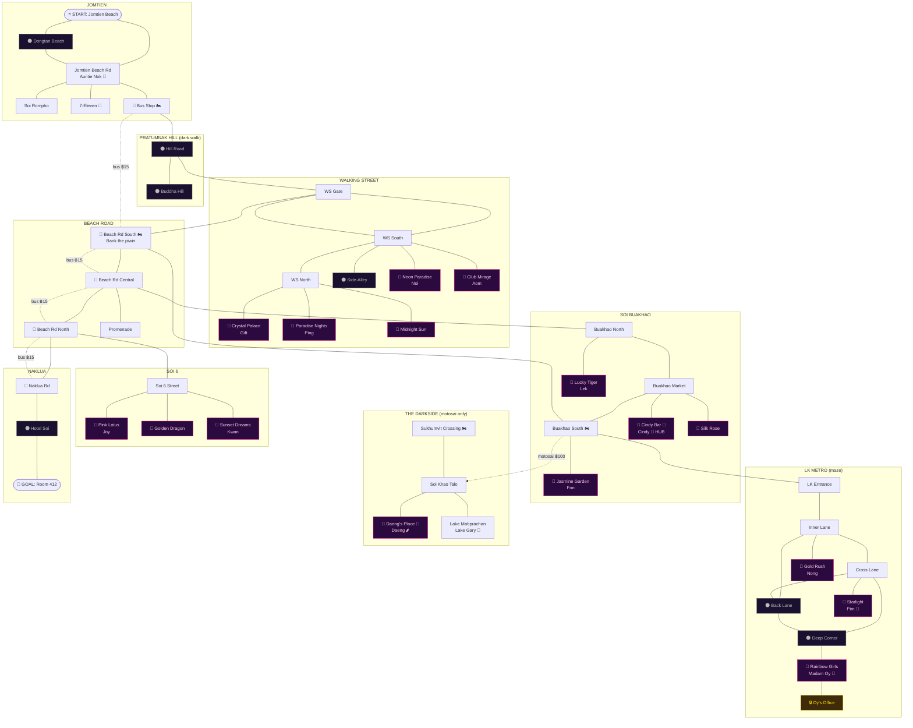

# The Last Baht Bus

A Zork-style text adventure set in the neon streets of Pattaya — part of the
[Soi Sanuk](https://soisanuk.github.io/) universe.

You wake face-down on Jomtien beach at sunset. Wallet: gone. Phone: 13%.
Your hotel is in Naklua, a long way north. The baht bus is ฿15 a head.
You have ฿0.

It's going to be one of those nights.

## Play

Open `web/index.html` in a browser — no build step, no dependencies, works from `file://`.
Mobile gets tappable verb chips; desktop gets ↑/↓ command history.

## The game

- **~45 rooms** across Jomtien, Pratumnak Hill, Beach Road, Walking Street,
  Soi Buakhao, the LK Metro maze, Soi 6, the Darkside (Lake Mabprachan &
  Soi Khao Talo), and Naklua. All 15 canon bars are enterable.
- **Money**: scrounge your first ฿15, then work the soi economy — bottle
  deposits, favours for the piwin, lady-drink diplomacy (฿150, as ever).
- **Phone battery is your lamp**: 13% and falling. Dark sois have soi dogs.
  ("You are likely to be bitten by a soi dog.")
- **Transport**: baht buses (฿15, the driver quotes the fare in spoken Thai —
  pay attention and pay exactly), motosai (faster, pricier, and the piwin
  network remembers a favour), or your own feet in the dark.
- **Thai as puzzle**: read เปิด/ปิด signs, navigate the LK Metro maze by its
  painted Thai arrows, and crack a safe whose keypad speaks only ๐–๙.
  A `wai` and a `sawatdee` open more doors than money.
- **Two solutions**: burgle the safe behind the go-go, or earn the Mamasan's
  respect and be handed your wallet like a gentleman. Score reflects style.

Type `HELP` in-game for the command list. The night autosaves after every
command (localStorage); reopening the page offers to continue where you left
off, and `UNDO` rewinds your last command.

## World map

<details>
<summary>Open the map (mild spoilers — room layout and who's where)</summary>

🌑 dark rooms · 🔌 charging outlets · 🚏 bus stops · 🏍️ motosai stands
(any stand reaches any destination; the dotted edge is the only practical
way across Sukhumvit). Solid = walking, dashed = baht bus.



</details>

## Test

```sh
node --test
```

51 tests: Thai number composition, world/map integrity (every exit resolves,
all 15 canon bars present, the gossip chain's flags all connect), parser and
systems, and a full scripted playthrough from the beach to the happy ending —
run headless via `node:vm` against the same files the browser loads.

## Structure

```
web/
  index.html       terminal shell + all CSS (Soi Sanuk neon palette)
  js/              classic scripts sharing globals (no modules — file:// works)
    thai.js        Thai numbers/numerals, signs, phrase matching (pure)
    world.js       rooms, items, NPCs, dialogue, bus/motosai lines (pure data)
    engine.js      parser, verb handlers, systems, endings (DOM-free at load)
    tts.js         th-TH Web Speech (Capacitor-ready)
    term.js        terminal DOM: scrollback, history, verb chips
    main.js        boot + save/load wiring (loaded last)
tests/js/          node:vm-loaded tests against the real sources
```

Engine and world are DOM-free at load time and print through an injected
callback, so the whole game runs headless in tests — same convention as the
Soi Sanuk trainer.
